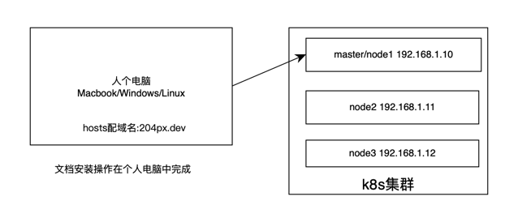

# pixie 安装手册



## 1. k8s 集群安装 nfs 存储插件

### 1.1 安装nfs服务端和客户端
在node2(192.168.1.12)节点安装 nfs 服务端
```shell
dnf install -y rpcbind nfs-utils
systemctl enable --now rpcbind
systemctl enable --now nfs-server

mkdir -p /data/pixie-nfs
echo "/data/pixie-nfs *(rw,sync,insecure,no_subtree_check,no_root_squash)" >> /etc/exports

systemctl restart rpcbind
systemctl restart nfs-server

showmount -e localhost
```

在 node1/node2/node3 节点安装 nfs 客户端
```shell
dnf install -y nfs-utils
showmount -e 192.168.1.12
```

### 1.2 k8s集群部署storageclass插件(pixie中的es、nats依赖存储插件)

权限配置 `kubectl apply -f 1.nfs-rabc.yaml`

```yaml
apiVersion: v1
kind: Namespace
metadata:
  name: nfs
---
apiVersion: v1
kind: ServiceAccount
metadata:
  name: nfs-client-provisioner
  namespace: nfs
---
kind: ClusterRole
apiVersion: rbac.authorization.k8s.io/v1
metadata:
  name: nfs-client-provisioner-runner
rules:
  - apiGroups: [""]
    resources: ["persistentvolumes"]
    verbs: ["get", "list", "watch", "create", "delete"]
  - apiGroups: [""]
    resources: ["persistentvolumeclaims"]
    verbs: ["get", "list", "watch", "update"]
  - apiGroups: ["storage.k8s.io"]
    resources: ["storageclasses"]
    verbs: ["get", "list", "watch"]
  - apiGroups: [""]
    resources: ["events"]
    verbs: ["create", "update", "patch"]
---
kind: ClusterRoleBinding
apiVersion: rbac.authorization.k8s.io/v1
metadata:
  name: run-nfs-client-provisioner
subjects:
  - kind: ServiceAccount
    name: nfs-client-provisioner
    # replace with namespace where provisioner is deployed
    namespace: nfs
roleRef:
  kind: ClusterRole
  name: nfs-client-provisioner-runner
  apiGroup: rbac.authorization.k8s.io
---
kind: Role
apiVersion: rbac.authorization.k8s.io/v1
metadata:
  name: leader-locking-nfs-client-provisioner
  namespace: nfs
rules:
  - apiGroups: [""]
    resources: ["endpoints"]
    verbs: ["get", "list", "watch", "create", "update", "patch"]
---
kind: RoleBinding
apiVersion: rbac.authorization.k8s.io/v1
metadata:
  name: leader-locking-nfs-client-provisioner
  namespace: nfs
subjects:
  - kind: ServiceAccount
    name: nfs-client-provisioner
    namespace: nfs
roleRef:
  kind: Role
  name: leader-locking-nfs-client-provisioner
  apiGroup: rbac.authorization.k8s.io
```

部署 provisioner `kubectl apply -f 2.nfs-deployment.yaml`
```shell
apiVersion: apps/v1
kind: Deployment
metadata:
  name: nfs-client-provisioner
  labels:
    app: nfs-client-provisioner
  namespace: nfs
spec:
  replicas: 1
  strategy:
    type: Recreate
  selector:
    matchLabels:
      app: nfs-client-provisioner
  template:
    metadata:
      labels:
        app: nfs-client-provisioner
    spec:
      serviceAccountName: nfs-client-provisioner
      containers:
        - name: nfs-client-provisioner
          image: quay.io/external_storage/nfs-client-provisioner:latest
          volumeMounts:
            - name: nfs-client-root
              mountPath: /persistentvolumes
          env:
            - name: PROVISIONER_NAME  # 存储分配器的默认名称
              value: nfs-provisioner
            - name: NFS_SERVER    # NFS服务器地址
              value: 192.168.1.12
            - name: NFS_PATH       # NFS共享目录地址
              value: /data/pixie-nfs
      volumes:
        - name: nfs-client-root
          nfs:
            server: 192.168.1.12 # NFS服务器地址
            path: /data/pixie-nfs     # NFS共享目录
```
配置 StorageClass `kubectl apply -f 3.nfs-storageclass.yaml`

注意，这里的 `storageclass.kubernetes.io/is-default-class: "true"` 让他成为默认的 StorageClass, 当pvc没有指定 StorageClass 就会用默认的，如果k8s集群中没有默认的StorageClass，Pod 会一直处于 Pending状态，在pixie的pvc中都没有指定StorageClass,所以这里配置为默认的（当然，也可以修改pixie的配置，指定StorageClass）
```yaml
apiVersion: storage.k8s.io/v1
kind: StorageClass
metadata:
  name: nfs   # StorageClass名称
  namespace: nfs
  annotations:
    storageclass.kubernetes.io/is-default-class: "true"
# 存储分配器名称,对应“2.nfs-deployment.yaml”文件中env.PROVISIONER_NAME.value
provisioner: nfs-provisioner
# 允许pvc创建后扩容
allowVolumeExpansion: True
parameters:
  archiveOnDelete: "false"
```

测试 `kubectl apply -f testpvc.yaml`, 这里没有指定 `storageClassName`
```yaml
apiVersion: v1
kind: PersistentVolumeClaim
metadata:
  name: testpvc
spec:
  accessModes:
    - ReadWriteMany
  # storageClassName: "nfs"
  resources:
    requests:
      storage: 500Mi
```
查看 pvc是不是 bound
```shell
kubectl get pvc
```

## pixie安装
cd tmp/204px.dev
